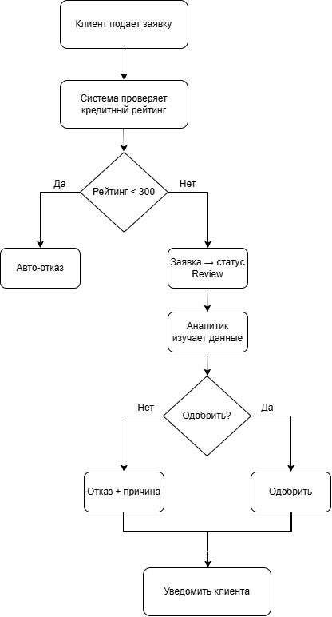

# Credit Application Analysis 🏦

> A systems- and business-analysis case study of a **credit-application
> process**: from a BPMN model of the workflow to functional requirements, a
> REST API specification, and a SQL data model implemented in SQLite.


## Overview

A full analyst work-up of a **credit-application system** — the kind of artefact
a systems/business analyst hands to a development team. It models the business
process, writes down what the system must do, specifies the API, and backs it
with a concrete relational data model and example queries.

The goal is not a running product but a **complete, consistent specification**:
process → requirements → interface → data.

## Business process (BPMN)

A BPMN model of the credit-application workflow — from submission and scoring to
the accept/reject decision and notification — with actors, tasks, gateways and
hand-offs. Full walkthrough in [`files/bpmn_description.md`](files/bpmn_description.md).



## What's inside

| Deliverable | File |
|-------------|------|
|  BPMN diagram of the process | [`files/bpmn_diagram.png.drawio.png`](files/bpmn_diagram.png.drawio.png) |
|  Process description | [`files/bpmn_description.md`](files/bpmn_description.md) |
|  Functional & non-functional requirements | [`files/requirements.md`](files/requirements.md) |
|  SQL queries (analytics on the data model) | [`files/queries.sql`](files/queries.sql) |
|  SQLite database | [`files/credit.db`](files/credit.db) |

The **requirements** cover the functional side (application intake, validation,
scoring, decisioning, status tracking) and the non-functional side (performance,
security, auditability), plus the **REST API** contract for the endpoints the
system exposes. The **data model** is realised as a SQLite database with a set
of analytical SQL queries in `queries.sql`.

## Repository structure

```
credit-analysis-project/
├── files/
│   ├── bpmn_diagram.png.drawio.png  # BPMN diagram (draw.io export)
│   ├── bpmn_description.md           # process description
│   ├── requirements.md              # functional & non-functional requirements + REST API
│   ├── queries.sql                  # analytical SQL queries
│   ├── credit.db                    # SQLite database
│   └── README.md                    # project notes (RU)
├── LICENSE
└── README.md                        # ← this file
```

## How to explore

1. Start with the **BPMN diagram** above to understand the process end-to-end.
2. Read [`files/requirements.md`](files/requirements.md) for what the system must
   do and its REST API contract.
3. Open the **SQLite database** and run the example queries to see the data model
   in action:

```bash
sqlite3 files/credit.db < files/queries.sql
```

## Tech & methods

`Business/Systems analysis` · `BPMN` · `Requirements engineering` · `REST API design` · `SQL` · `SQLite`

## What I practised

- Modelling a real business process in **BPMN**
- Writing clear **functional / non-functional requirements** and a **REST API** contract
- Designing a **relational data model** and writing analytical **SQL** on it

## License

MIT — see [LICENSE](LICENSE).

---

<details>
<summary>🇷🇺 Кратко на русском</summary>

<br>

Аналитическая проработка системы **кредитных заявок** — то, что системный/бизнес-
аналитик передаёт команде разработки. Внутри: **BPMN-диаграмма** процесса (от
подачи заявки и скоринга до решения и уведомления) и её описание, **функциональные
и нефункциональные требования** со спецификацией **REST API**, а также
**реляционная модель данных** — база **SQLite** (`credit.db`) с набором
аналитических **SQL-запросов** (`queries.sql`). Цель — не готовый продукт, а полная
и согласованная спецификация: процесс → требования → интерфейс → данные.

</details>
